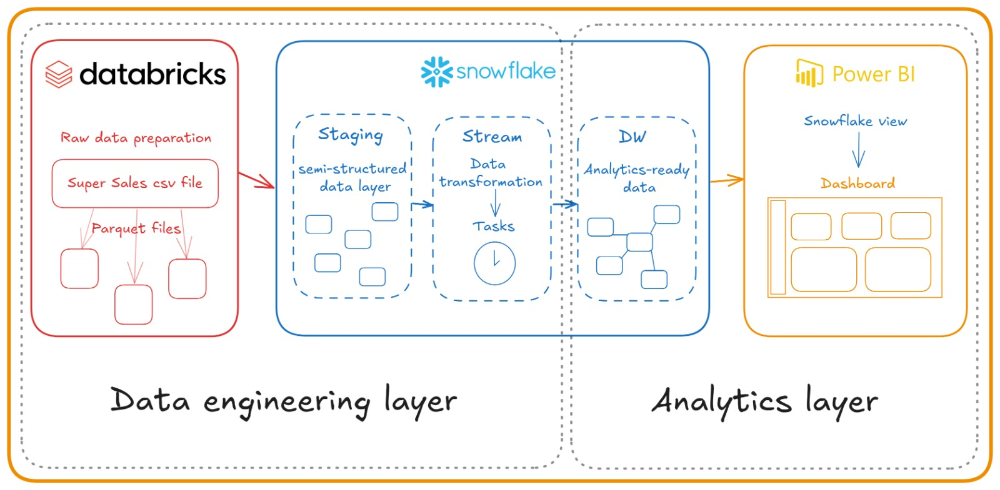

# Super Store Sales - data analysis and modeling project from ETL to analytics

### Super Store Sales is a complete project that encompasses all phases, from raw data extraction to data normalization and modeling in a data warehouse. This project provides a clear and practical example of how most of the work carried out by data analysts works, who face the daily challenge of using high-performance tools to achieve the best results.

## Description

#### The project basically consists of two stages: The first one is data engineering layer and the second one is data analytics layer. Here I used Databricks to prepare the raw data source (a CSV file) and start normalizing the data. Snowflake is used as the main database responsible for transforming the data after insertion by Databricks. The final result is a data warehouse prepared for creating views that can be used in analytics projects. The image below provides a graphical representation of the steps performed.
&nbsp;

&nbsp;

## Data engineering layer

#### We can divide this layer into two important parts for the data engineering of this project. The raw data processing part done by Databricks and the processing of the staging and dw tables from Snowflake.

### Databricks data preparation

#### In the first part of processing, the CSV file is inserted into a directory in Databricks using Spark functions for creating folders and inserting data. The original file of this database can be downloaded for free through this [link](https://www.kaggle.com/datasets/ishanshrivastava28/superstore-sales).
&nbsp;
#### All the processing of the dataset can be viewed by consulting the data_preparation.ipynb file.

#### After the initial processing of the file, it is divided into several parquet files corresponding to the dimensions. This division will give rise to the Snowflake staging tables. Below is an example of the products dimension:
&nbsp;
```python
df_products = supersales.select('Product ID', 'Category', 'Sub-Category', 'Product Name').distinct()

df_products_renamed = df_products.withColumnRenamed("Product ID", "Product_ID")\
                                 .withColumnRenamed("Sub-Category", "Sub_Category")\
                                 .withColumnRenamed("Product Name", "Product_Name")

df_products_renamed.write \
  .format('parquet') \
  .mode("overwrite") \
  .save("/FileStore/tables/dimensions/productsParquet")
```
&nbsp;
#### With all dimensions saved in their parquet files, I started loading the tables into the staging layer in Snowflake. The connection configuration between Databricks and Snowflake is simple and is exemplified below along with its insert execution function.
```python
# Options for connecting to Snowflake

options = {
  "sfUrl": "https://qjyzviq-wj82064.snowflakecomputing.com",
  "sfUser": "********",
  "sfPassword": "**********",
  "sfDatabase": "SUPERSALESSTORE",
  "sfSchema": "STAGING",
  "sfWarehouse": "COMPUTE_WH"
}

# Function for inserting data into the STAGING tables of the Snowflake database

def write_to_snowflake(df, table_name):
  try:
    df.write \
      .format("snowflake") \
      .options(**options) \
      .option("dbtable",table_name)\
      .mode("append") \
      .save()
    return True
  
  except Exception as e:
    return e
```
&nbsp;

### Snowflake staging schema

#### Data comes from Databricks and is inserted into tables defined in the Snowflake staging layer. This is the stage where Snowflake itself identifies new insertions and prepares them to be inserted into the data warehouse tables using the streams tables. Below you can see the definition of the tables in the staging layer.
&nbsp;
```sql
CREATE OR REPLACE TABLE ADDRESS(
    POSTAL_CODE INT,
    COUNTRY STRING,
    CITY STRING,
    STATE STRING,    
    REGION STRING
)


CREATE OR REPLACE TABLE PRODUCTS(
    Product_ID STRING,
    Category STRING,
    SubCategory STRING,
    Product_Name STRING
)


CREATE OR REPLACE TABLE CUSTOMERS(
    Customer_ID STRING,
    Customer_Name STRING,
    Segment STRING
)


CREATE OR REPLACE TABLE SALES(
    Row_ID int,
    Order_ID string,
    Order_Date date,
    Ship_Date date,
    Ship_Mode string,
    Customer_ID string,
    Postal_Code int,
    Product_ID string,
    Sales decimal(10,2),
    Quantity int,
    Discount decimal(10,2),
    Profit decimal(10,2)
)
```
&nbsp;
### Snowflake stream process

#### Snowflake has a very versatile feature that can help in building data ETLs. These are Streams tables. Streams are created to identify changes in a given table. From the streams, it is possible to take various actions when manipulating observed tables, such as new rows inserted or updates, and even data deletion. In addition to Streams, there are Tasks. Tasks can be executed after a certain defined time or can be aligned in sequence. For this project, the tasks were defined in sequence, first with the execution of the dimensions, then for the fact.
#### Below you can see an example of the Stream defined for the sales table together with the Task for inserting data from the staging table into the data warehouse.
&nbsp;
```sql
--STREAM SALES STAGING TABLE

CREATE STREAM sales_stream ON TABLE supersalesstore.staging.sales;

-- TASK CREATED TO COLLECT DATA FROM STREAM AND INSERT INTO DW.
CREATE OR REPLACE TASK task_fact_sales
WAREHOUSE = COMPUTE_WH
AFTER task_dim_address
AS
INSERT INTO supersalesstore.dw.fact_sales (row_id, order_id, ship_mode, sk_product, sk_address, sk_customer, sk_order_date, sk_ship_date, sales, quantity, discount, profit)
SELECT 
    ss.row_id,
    ss.order_id,  
    ss.ship_mode,    
    (SELECT MAX(sk_product) FROM supersalesstore.dw.dim_products WHERE product_id = ss.product_id) as sk_product,
    (SELECT MAX(sk_address) FROM supersalesstore.dw.dim_address WHERE postal_code = ss.postal_code) as sk_address,
    (SELECT MAX(sk_customer) FROM supersalesstore.dw.dim_customers WHERE customer_id = ss.customer_id) as sk_customer,
    (SELECT MAX(sk_date) FROM supersalesstore.dw.dim_dates WHERE date = ss.order_date) as sk_order_date,
    (SELECT MAX(sk_date) FROM supersalesstore.dw.dim_dates WHERE date = ss.ship_date) as sk_ship_date,
    ss.sales,
    ss.quantity,
    ss.discount,
    ss.profit
FROM 
    sales_stream ss
WHERE 
    ss.METADATA$ACTION = 'INSERT';
```
&nbsp;
### Snowflake Data warehouse tables

#### The tables present in the data warehouse layer of the database are ready for analytics purposes. Their definitions are more precise and their relationships are identified and created. See below their definition and compare with the staging tables.
&nbsp;
```sql
CREATE TABLE Dim_Products(
    sk_product INTEGER AUTOINCREMENT PRIMARY KEY,
    product_id varchar(50) not null,
    category varchar(50) not null,
    product_name varchar(500) not null    
)

CREATE TABLE Dim_Customers(
    sk_customer INTEGER AUTOINCREMENT PRIMARY KEY,
    customer_id varchar(50) not null,
    customer_name varchar(100) not null,
    segment varchar(50) null
)

CREATE TABLE Dim_Address(
    sk_address INTEGER AUTOINCREMENT PRIMARY KEY,
    postal_code integer not null,
    country varchar(50) not null,
    city varchar(50) not null,
    state varchar(50) not null,
    region varchar(50) not null
)

CREATE TABLE Dim_Dates (
  sk_date INTEGER AUTOINCREMENT PRIMARY KEY,
  date DATE NOT NULL UNIQUE,
  day INTEGER NOT NULL,
  month INTEGER NOT NULL,
  year INTEGER NOT NULL,
  quarter INTEGER NOT NULL
)

CREATE TABLE Fact_Sales(
    sk_sales INTEGER AUTOINCREMENT PRIMARY KEY,
    row_id integer not null,
    order_id varchar(100) not null,
    ship_mode varchar(50) null,
    sk_product integer not null,
    sk_address integer not null,
    sk_customer integer not null,
    sk_order_date integer not null,
    sk_ship_date integer not null,
    sales decimal(10,2) null,
    quantity integer null,
    discount decimal(10,2) null,
    profit decimal(10,2) null,
    FOREIGN KEY (sk_product) REFERENCES Dim_Products(sk_product),
    FOREIGN KEY (sk_address) REFERENCES Dim_Address(sk_address),
    FOREIGN KEY (sk_customer) REFERENCES Dim_Customers(sk_customer),
    FOREIGN KEY (sk_order_date) REFERENCES Dim_Dates(sk_date)
)
```
&nbsp;
## Data analytics layer

#### The analytics layer can be understood in this context as the creation of purpose-driven views in Snowflake and the development of dashboards and reports.

### Snowflake views

#### Creating views with specific objectives can be a viable solution to reduce complexity in BI semantic models. For this project, I chose to create views in Snowflake so that the responsibility for establishing relationships between dimensions tables and the fact table would be the database itself.
#### The view created for the Sales store analytics project is described below:
&nbsp;
```sql
create or replace view SUPERSALESSTORE.DW.VIEW_SALESSTORE(
	ORDER_ID,
	ORDER_DATE,
	SHIP_DATE,
	SHIP_MODE,
	PRODUCT_NAME,
	CATEGORY,
	CUSTOMER_NAME,
	SEGMENT,
	CITY,
	STATE,
	REGION,
	COUNTRY,
	LOCATION,
	SALES,
	QUANTITY,
	DISCOUNT,
	PROFIT
) as
select
 s.order_id,
 od.date as order_date,
 sd.date as ship_date,
 s.ship_mode,
 p.product_name,
 p.category, 
 c.customer_name,
 c.segment,
 a.city,
 a.state,
 a.region,
 a.country,
 CONCAT_WS('-', a.city, a.state) as location,
 s.sales,
 s.quantity,
 s.discount,
 s.profit
from 
    supersalesstore.dw.fact_sales as s
left outer join supersalesstore.dw.dim_dates as od on (s.sk_order_date = od.sk_date)
left outer join supersalesstore.dw.dim_dates as sd on (s.sk_ship_date = sd.sk_date)
left outer join supersalesstore.dw.dim_products as p on (s.sk_product = p.sk_product)
left outer join supersalesstore.dw.dim_customers as c on (s.sk_customer = c.sk_customer)
left outer join supersalesstore.dw.dim_address as a on (s.sk_address = a.sk_address);
```
&nbsp;
### Power BI dashboard

#### The project developed in Power BI aims to evaluate sales by relating the monetary sales totals and highlighting the profitability of sales. This relationship is evidenced by showing the participation of products, customers, segments, shipping method and the entire annual evolution of the numbers.
&nbsp;

&nbsp;

## Conclusion
### This project sought to bring together some of the main processes commonly used by data analysts and engineers regarding data normalization and modeling. Some of the main tools currently present in the job market were used, such as Databricks and Snowflake. Despite being competitors, together they can work to add value to the business.

## Author
- Tiago Bratz Heck
##### Access my [LinkedIn](https://www.linkedin.com/in/tiago-analista-de-dados/) profile.